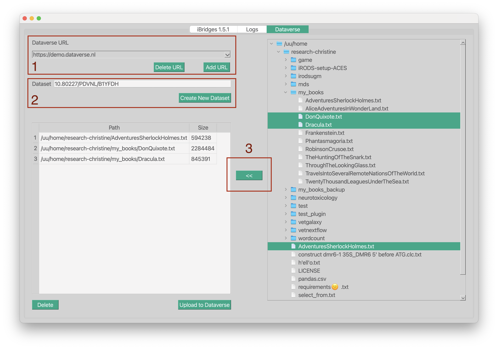

# iBridges Dataverse  
[`https://github.com/iBridges-for-iRODS/ibridges-plugin-dataverse/actions/workflows/python_package.yml`](https://github.com/iBridges-for-iRODS/ibridges-plugin-dataverse/actions/workflows/python_package.yml)

This package provides a Dataverse plugin for the iBridges CLI and GUI.  
It allows you to create Dataverse datasets and upload iRODS data objects.

## Dependencies

- Python 3.9+
- HTTPX  
- PyDataverse  
- iBridges and iBridges GUI (`ibridges`, `ibridgesgui`)

All dependencies are installable via `pip`.

## Highlights

- Automatic checksum verification during upload  
- Git‑like workflow: stage files first, upload later  
- Shared state between CLI and GUI — switch freely without losing progress  

## :warning: Important Notes

- Only files **smaller than 9 GB** are transferred.  
- All iRODS data is **downloaded locally** before being uploaded to Dataverse.

  Files are downloaded one by one into a temporary directory, uploaded to Dataverse, and then deleted.  
  You therefore need at least **9 GB of free disk space**.  
  If an upload fails, the temporary file is **not** deleted, so files may accumulate.

## Installation

### Install from PyPI

```
pip install ibridgesdvn
```

### Install the CLI from GitHub

```
pip install git+https://github.com/iBridges-for-iRODS/ibridges-plugin-dataverse.git
```

### Install both GUI and CLI

```
pip install git+https://github.com/iBridges-for-iRODS/ibridges-plugin-dataverse.git
pip install "ibridgesdvn[gui]"
```

This installs the Python package `ibridgesdvn`.

## CLI Commands

Starting the iBridges CLI (`ibridges -h`) shows the additional Dataverse commands:

```
ibridgesdvn commands:
    dv-add-file        Stage iRODS files for upload.
    dv-cleanup         Clean up local Dataverse logs.
    dv-create-ds       Create a new Dataverse dataset.
    dv-draft           Show or delete draft datasets.
    dv-init            Store a Dataverse API token.
    dv-push            Upload staged files.
    dv-rm-file         Remove staged files.
    dv-setup           Manage Dataverse configurations.
    dv-status          Show pending uploads and drafts.
    dv-switch          Switch Dataverse configuration.
```

If you use the iBridges GUI, a **Dataverse** view becomes available.

## The Dataverse View



1. **Configure your Dataverse connection**  
   Add or remove Dataverse configurations.

2. **Select a Dataverse collection**  
   If you don’t have a dataset yet, click **Create New Dataset** to generate one and obtain its DOI.

3. **Select iRODS data objects**  
   Use the right-hand browser to select files.  
   Click **<<** to stage them for upload.  
   You may remove entries at any time.

When ready, click **Upload to Dataverse**.  
After upload, open the dataset in your browser to finalize publication.

## Dataverse Commands

### Configuring a Dataverse Instance

List or create Dataverse configurations:

```
ibridges dv-setup dvnl-demo https://demo.dataverse.nl
```

Activate a configuration and store an API token:

```
ibridges dv-init dvnl-demo
Your Dataverse token for dvnl-demo :
  demo -> https://demo.dataverse.org
* dvnl-demo -> https://demo.dataverse.nl
```

Switch between configurations:

```
ibridges dv-switch https://demo.dataverse.org
* demo -> https://demo.dataverse.org
  dvnl-demo -> https://demo.dataverse.nl
```

You may use **URLs or aliases interchangeably**.

> Note: These setup commands are available only in the CLI, not in the shell.  
> All other commands work in both.


### Creating a Dataset

You can create a dataset using a Dataverse `dataset.json`:

```
ibridges shell
ibshell:research-christine> dv-create-ds UUscience --metajson ibridgescontrib/ibridgesdvn/dataset.json
Dataset with pid 'doi:10.80227/PDVNL/RZQRAK' created.
```

Save the dataset identifier (e.g., `10.80227/PDVNL/RZQRAK`) — you will need it for staging and uploading files.

Alternatively, create minimal metadata interactively:

```
ibshell:research-christine> dv-create-ds UUscience
```

This opens a short questionnaire for the required fields.

### Browsing Files and Staging Them

Browse iRODS collections:

```
ibshell:research-christine> ls my_books
```

Stage files for upload:

```
ibshell:research-christine> dv-add-file 10.80227/PDVNL/RZQRAK irods:my_books/AdventuresSherlockHolmes.txt irods:my_books/DonQuixote.txt
```

All iRODS paths must be prefixed with `irods:`.  
Relative paths are supported.

View the staging summary:

```
{'https://demo.dataverse.nl': {'add_file': [...]}}
```

Remove staged files:

```
ibshell:research-christine> dv-rm-file 10.80227/PDVNL/RZQRAK irods:my_books/DonQuixote.txt
```

Check status:

```
ibshell:research-christine> dv-status
```

Check opened drafts:

```
ibshell:research-christine> dv-draft
```

### Uploading Data

Upload staged files:

```
ibshell:research-christine> dv-push 10.80227/PDVNL/RZQRAK
```

Files are downloaded to a temporary directory, uploaded to Dataverse, and removed locally if successful.

After upload, the status becomes empty:

```
ibshell:research-christine> dv-status
```